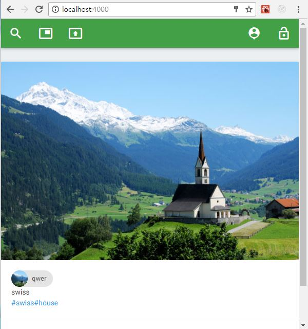

# react-image-example
<li>Hello, It's image web application such as instagram.</li>
<li>I use react, redux, express, nodejs, mongodb. And images are saved to mongoDB.</li>
<li>You could use this application on mobile, desktop</li>

# Getting started
First, you should clone this source

    git clone https://github.com/rso1904/jwt-image-example.git

After you finshed above, you should follow below instruction.

    1. npm install
    2. npm run clean
    3. npm run build
    4. npm run start
    
# snapshot

